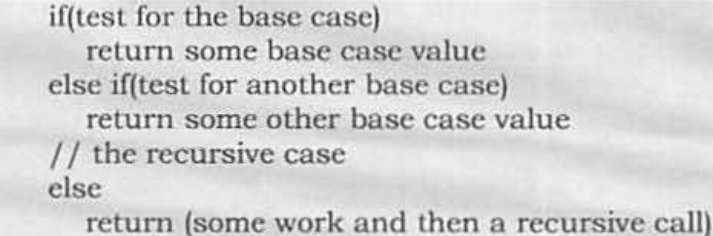

# Recursion and backtracking
Recursion and backtracking is a subject that I love. IO got my hands dirty with recursion.

backtracking is a subjeect I'd LOVE to work closely with.

let's hopw that this chapter enables me to do just that.

##What is recursion?
Any fucntion that calls itself is recursive.

This is useful when the functio;n calls itself on a subset of its inpuit

for recursion to be feasible, it has to stop at some point. This is where the base case comes in

##Why recursion?
1. Makes the Code more concise
2. Can rewrite loops (what's better?)
  - [Click Here For a nice article on GeekforGeeks that compares iteration and recursion](https://www.geeksforgeeks.org/difference-between-recursion-and-iteration/)
3. it is useful for task, that can be divided into subtasks: searching, sorting etc  
##Format of a recursive function
We need two parts:
- Recursion step
- Base case step

## Recursion and memory
recursion is heavy on memory. Let's elaborate:

    Each recursive call make a copy of hte variables. Once the function ends, the data is removed.

    But any parent stay alive until all of its children have finished

    There aer cases where we onl.y know how to solve a problem through recursion.
