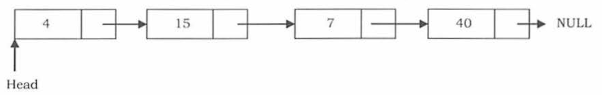
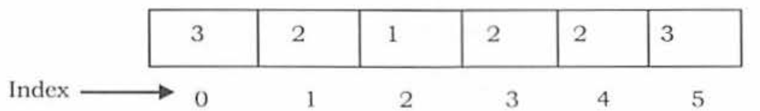
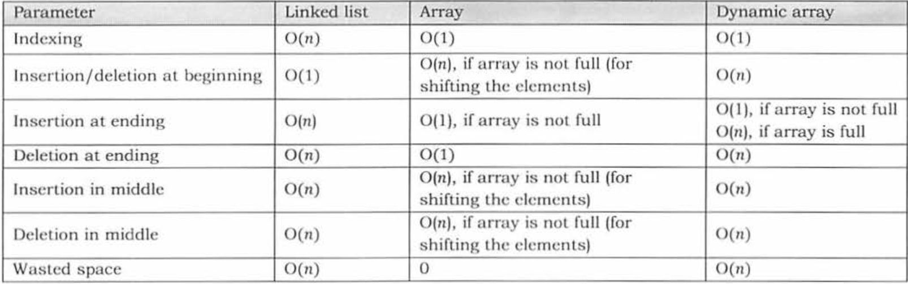
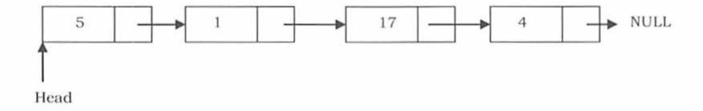

# LINKED LISTS
## „hat is a linked list?
a linked list is a data structure used to store a collection of data
- Elements are connecteed by pointers
- last element points to NULL
- a lisgt can grow or shrink during execution
- can be made just as long as needed (in cnotrast with arrays)
- doesn't waste memory but has overhead cost ]ofo pointers



## Linked lists ADT
**main functions**
- insert
- Delete element from a certainn location

**Aux functions**
- Delete _all_ list
- count
- find nth node from the end

## Why LL?
let's start by compparing LLs and arrays;
## array overview
- One memory block is allocated for the whole array of elements.
  - This means that empty elements take up as much memmory.
-Elements can be accessed in constant time



The access time is constant as we have contiguous allocation of pointers in memory. thus, any access is just an addition to the first element. (is this the main reason why programming is indexed at 0?)

**Advantages of arrays**:
- Simple
- fast access to elements

**DISadvantages of arrays**:
- Fixed size
- one block
- complex position based insertion

**Dynamic Arrays**: those are resizable arrays

**Advantages of LLs**:
- they get expanded in constant time
- don't waste memory like arrays

**DISadvantages of LLs**:
- Access time is O(n)
- Harder cashing with modern CPU architectures
- Overhead with storing and retrieving data
- Waste memory for extra pointers

## Comparison of arrays,LLs and dynamic Arrays


## Singly linked LISTS
Here is the implementation of a [singly linked list](src/LinkedList.py)

**Node for a singly  linkec list**
- Constructor
  - initialise space for the data being stored
  - initialize space for hte pointer to the next element.
- functions
  - set the data
  - get the data
  - set next's data
  - has next
    - return true when a next element exists

**Basic operations**:
- Traversing the list
- Inserting
- Deleting

**Traverse**
- set the Head pointer to the first element of the list
- follow the pointers
- do something with the elements of the nodes
- repeat until we hit a NULL pointer



Example of list traversal to print


**Time complexity:** O(n)
**space Complexity:** O(n) _for creating an extra list_
```python
def print_list(self):
    nodeList = []
    currentnode = self.head
    while currentnode != None:
        nodeList.append(currentnode.data)
        currentnode = currentnode.next

    print nodeList  
```
**Insertion**

We have three cases to worry abouit when inserting in a singly linked list:
- Beginning
- Middle
- end

**Beginning**

it's a two step dance:
- update the pointer of the new element to the current Head
- set new hea to the element
_do not frget to update the length of the list_
Code:
```python
def addBeg(self, node):
    newNode = node
    newNode.next = self.head
    self.head = newNode
    self.length += 1
```

**Ending**

- New node's next pointer is set to NULL
- Last node's pointer is set to new node

```python
def addLast(self, node):
    currentnode = self.head

    while currentnode.next != None: # Find thte last node
        currentnode = currentnode.next

    newNode = node
    newNode.next = None
    currentnode.next = newNode
    self.length = self.length + 1
```

_Also: don't forgdet to increment_

**Inserting at the middle**
```python
def addAtPos(self, pos, node):
    count = 0
    currentnode = self.head
    previousnode = self.head

    if pos > self.length or pos < 0:
        print "The position does not exist. Please enter a valid position"
    else:
        while currentnode.next != None or count < pos:
            count = count + 1
            if count == pos:
                previousnode.next = node
                node.next = currentnode
                self.length += 1
                return

            else:
                previousnode = currentnode
                currentnode = currentnode.next
```
**Deleting is similar to adding but it's in reverse**
